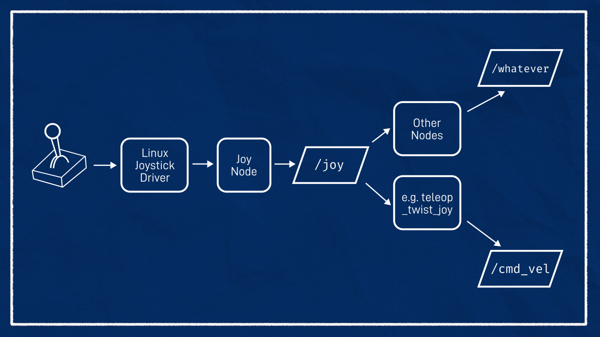

# rexbot_one

## Table of Contents
- [Background](#background)
- [Dependencies](#dependencies)
- [Getting Started](#getting-started)
- [References](#references)

## Background

### Robot State Publisher


### Teleops


## Dependencies

### Controls
Install the following packages:
- `ros-humble-ros2-control`
- `ros-humble-ros2-controllers`
- `ros-humble-gazebo-ros2-control`

```bash
sudo apt install ros-humble-ros2-control ros-humble-ros2-controllers ros-humble-gazebo-ros2-control
```

### Teleops

Install the following packages:
- `joystick`
- `jstest-gtk`
- `evtest`
- `teleop_twist_joy`

```bash
sudo apt install joystick jstest-gtk evtest teleop_twist_joy
```

Check that joystick works with linux (Opation)
- Select a event number and any button presses should cause some new text to come through on the screen.

```bash
```


## Getting Started

### 1. Build the Package
```bash
colcon build --packages-select rexbot_one
source install/setup.bash
```

### 2. Launch with Simulation
```bash
ros2 launch rexbot_one launch_sim.launch.py
```

### 3. Visualize the Robot
```bash
rviz2
```

> **Note:** To visualize movable joints, publish their state:
> ```bash
> ros2 run joint_state_publisher_gui joint_state_publisher_gui
> ```

## References

- Design robot